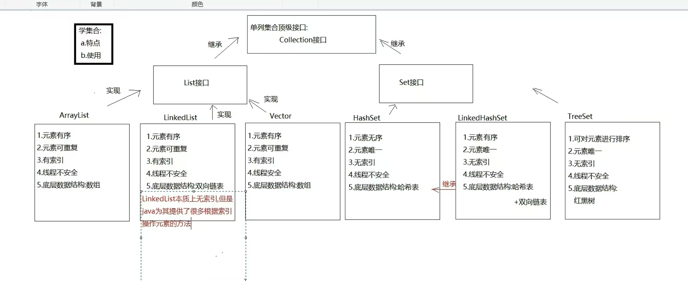

# 第一章Java基础
## 1.1.1基本数据类型
### 整数类型：
```java
    //byte:8位
    byte b = 10;
    //short:16位
    short s=10;
    //int:32位
    int i =10;
    //long:64位
    long lon = 10;
```
### 浮点类型：
```java
    //默认情况下：小数点的数据会被识别为精度较高的双精度double类型
    //float:单精度浮点类型,数据需要使用F(f)结尾
    float f = 1.0;//(x)
    float f = 1.0f;
    //double:双精度浮点类型
    double d = 2.0;
```
### 字符类型：
    char c = 'A';
### 布尔类型
    //true,false,标志判断条件是否成立
    boolean bln = true;
### 数据类型转换
```java
    //byte->short->int->long->float->double
    byte b = 10;
    short s = b;
    int i = s;
    double d=f;
    //...范围小的数据可以直接转换为范围大的
    int i = d(x);
    int i = (int)d;//()强制转换
```
## 1.1.2基本数据类型与包装类
    //包装类就是把基本类型的数据包装成对象
         包装类：把基本类型变成对象,才能放进集合（比如 ArrayList）、做 null 判断、调用方法
    | 基本数据类型 | 包装类      | 占用字节 |
    | ----------- | ----------- | -------- | 
    | byte        | Byte        | 1        |
    | short       | Short       | 2        |    基本类型的数据包装成对象方案
    | int         | Integer     | 4        |    public Integer(int value):已过时
    | long        | Long        | 8        |    public static Integer valueOf(int i)
    | float       | Float       | 4        |
    | double      | Double      | 8        |
    | char        | Character   | 2        |
    | boolean     | Boolean     | 1        |
    包装类的其他常见操作  "123"-->123 123-->"123"
        可以把基本数据类型转换为字符串类型。
        public static String toString(double d)
        public String toString()
        可以把字符串类型的数值转换为数值本身对应的数据类型
```java
    public class Test{
        public static void main(String[] args){
            //获取Integer类型的对象
            //public Integer(int value)
            Integer i1 = new Integer(value,100);
            System.out.println(i1);//100
            //public static Integer valueOf(int i)
            Integer i2 = Integer.valueOf(100);
            System.out.println(i2);//100
            //自动装箱：基本数据类型可以自动转换为对应的包装类型
            //Integer i3 = Integer.valueOf(100);
            Integer i3 = 100;
            //自动拆箱：包装类型可以自动转换为对应的基本数据类型
            //int num = i3.intValue();
            int num = i3;
            
            //基本类型-->字符串类型
            int num = 100;
            //方式1：数值+"" 原因：字符串参与加法操作，加法起到的是拼接作用，拼接之后是一个新的字符串
            String s1 = num+"";//"100"
            //方式2: Integer类：public static String toString(int i)
            String s2 = Integer.toString(num);//"100"
            //方式3： Integer类：public String toString
            Integer i = num;
            String s3 = i.toString();//"100"
            //方式4：String类：public static String valveOf(int i)
            String s4 = String.valueOf(num);
            
            //字符串类-->基本数据类型
            //注意：字符串中必须是数字字符
            String s = "123";
            //方式1：Integer类：public static int parseInt(String s)
            int i1 = Integer.parseInt(s);
            System.out.println(i1);//123
            //方式2：Integer类：public static Integer valuOf(String s)
            int i2 = Integer.valueOf(s);//自动拆箱
        }
    }
```
## 1.1.3引用数据类型
    //可被引用的数据类型
### 类：
### 接口：
### 数组：
### 枚举：
### 特殊类型值：null
## 1.2流程控制
### 1.2.1 if-else条件判断
### 1.2.2 switch分支语句
```java
    public class SwitchDemo {
        public static void main(String[] args) {
            int num = 2;
                switch (num) {
                case 1:
                    System.out.println("星期一");
                    break;
                case 2:
                    System.out.println("星期二");
                    break;
                case 3:
                    System.out.println("星期三");
                    break;
                default:
                    System.out.println("输入无效");
        }
    }
}
```
### 1.2.3 三元运算符
    关系表达式?表达式1:表达式2；
    true->执行表达式1    false->执行表达式2
### 1.2.4 ==与equals区别
#### 基本类型
    int a=10,b=10;
    System.out.println(a==b)//true
#### 引用类型
    String s1 = new String("abc");
    String s2 = new String("abc");
    System.out.println(s1==s2);//false
    System.out.println(s1.equals(s2));//true
#### 区别
    ==     -> 比地址（是不是同一个对象）
    equals -> 比内容（值是否一样）
    Java有字符串常量池优化：
    String s1 = "abc",s2 = "abc";
    System.out.println(s1==s2);//true
### 1.3 循环结构
#### 1.3.1 for循环
#### 1.3.2 while循环
#### 1.3.3 break/continue
    break 直接结束循环；
    continue 跳过本次；
### 1.4 数组与方法
#### 1.4.1 一维数组、二维数组定义与使用
    数组一旦创建长度不可修改
##### 一维数组
    // 格式1：声明+初始化（推荐，简洁）
    int[] arr1 = {1, 2, 3, 4, 5};
    // 格式2：声明数组，指定长度，后续赋值（默认初始化：int为0，String为null）
    int[] arr2 = new int[5]; // 长度为5，元素默认是0
    // 格式3：声明与初始化分开（不推荐，冗余）
    int[] arr3;
    arr3 = new int[]{10, 20, 30};
##### 二维数组
    // 格式1：声明+初始化（推荐，不规则数组也适用）
    int[][] arr1 = {{1,2}, {3,4,5}, {6}};

    // 格式2：指定行数和列数，后续赋值（默认初始化）
    int[][] arr2 = new int[3][2]; // 3行2列，所有元素默认0
    arr2[0][0] = 1; // 给第1行第1列赋值
    arr2[1][1] = 2;

    // 格式3：先指定行数，列数后续确定（不规则数组）
    int[][] arr3 = new int[3][];
    arr3[0] = new int[2]; // 第1行2列
    arr3[1] = new int[3]; // 第2行3列
#### 1.4.2 方法定义、参数、返回值
        修饰符 返回值类型 方法名(参数列表) {
            // 方法体：要执行的代码
            return 返回值; // 有返回值时必须写，无返回值可省略
        }
#### 1.4.3 参数传递：值传递理解
```java
    public class Test {
        public static void main(String[] args) {
            int a = 10;
            change(a);
            System.out.println(a); // ?
            int[] arr = {1, 2, 3};
            changeArr(arr);
            System.out.println(arr[0]); // ?
        }
        public static void change(int x) {
            x = 100;
        }
        public static void changeArr(int[] arr) {
            arr[0] = 999;
        }
    }
```
    a=10,arr[0]=999
##### 基本类型
        main:
        a=10
        调用 change(a)    change:     x = a 的拷贝 = 10
                                      x = 100(只改副本)
        main里的a：不变
##### 数组
         main:
         arr->指向[1,2,3]
         调用 changeArr(arr)  changeArr:   arr = 地址的拷贝（指向同一个数组）
                                           arr[0] = 999->改的是同一块内存
# 第二章 面向对象
## 2.1 类与对象、封装
### 2.1.1 类与对象的定义
```java
public class Main {
    public static void main(String[] args) {
        //类：结构体，里面包含了属性（特征）和方法（行为） 会有很多对象
        //TODO class(类)
        /*
        类的语法基本结构
        class ：关键字（全是小写）
        类名：类的名称，标识符，遵循规则，类首字母大写
        class 类名{
            特征（属性），
            功能（方法）
        }
        
        //对象：类的实例化（具象化）
        创建对象的语法：
        new ： 关键字，表示创建一个具体的对象
        变量的类型就是对象的类型
        对象是将内存地址赋值给了变量，使用变量其实引用了内存中的对象，所以称之为引用变量
        而变量的类型称之为引用数据类型
        new 类名（）；
        
        //特殊对象：空对象（null）,没有引用的对象，称之为空对象，关键字对象
        //所有引用类型变量的默认值就是null
        */
        //问题：做一道菜，红烧排骨
        //类：菜， 对象：红烧排骨
        //TODO 1. 先声明类
        //TODO 2. 创建对象
        //TODO 3. 声明属性，所谓的属性就是类中的变量
        //        变量类型  变量名称 = 变量值
        //        属性类型  属性名称 = 属性值
        //TODO 4. 声明方法
        //        void 方法名（参数）{功能代码}
        //TODO 5. 执行方法
        //        对象.属性
        //        对象.方法名（）
        
        //引用数据类型
        Cooking c = new Cooking();
        c.name = "红烧排骨";
        c.food = "排骨";
        c.execute();//？烹饪排骨
    }
}
class Cooking{
    //特征（属性）
    //名字
    String name;
    //菜的类型
    String type = "红烧";
    //食材
    String food;
    //佐料
    String relish = "大料";
    
    //TODO 执行
    void execute(){
        System.out.println("烹饪"+food);
    }
}
```
    
### 2.1.2 成员变量、成员方法
#### 成员变量
        成员变量就是属性
        属性类型 属性名称 = 属性值
        如果在声明属性的同时初始化赋值，那么所有对象的属性就完全相同
        //默认初始化
        //byete,short,int,long=>0
        //float,double=>0.0
        //boolean flg = false
        //char = 空字符
        //引用数据类型 => null

        //变量的作用域非常小，只在当前大括号内有效
        //属性不仅在当前类有效，而且可以随着对象在其他地方使用
        //变量使用前必须初始化，属性不用，JVM会帮助我们自动完成初始化
#### 成员方法
        //方法调用方式：对象.方法名（）
###### 方法参数
            参数个数，类型，顺序需相匹配
            当参数个数不相同，但类型相同时，可采用持续的参数语法声明：可变参数
                void test(String...name){}
                如果可变参数中还含有其他参数，要把可变参数放在最后
                    void test(int age,String...name)
##### 方法参数-传值方式
```java
//java中方法参数传递为值传递
//基本数据类型：数值
//引用数据类型：引用地址
//1
public class Main{
    public static void main(String[] args){
        int i = 10;
        test(i);
        System.out.println(i);//10
    }
    public  static void test(int i){
        i = i + 10;
    }
}
//2
public class Main{
    public static void main(String[] args){
        String s = "abc";
        test(s);
        System.out.println(s);//abc
    }
    public  static void test(String s){
        s = s + 10;
    }
}
//3
public class Main{
    public static void main(String[] args){
        User user = new User();
        user.name = "zhangsan";
        System.out.println(user.name);//
    }
    public  static void test(User user){
        user.name="lisi";
    }
}
class User{
    String name;
}
```
### 2.1.3 封装： private + get/set
#### 封装的定义
        把成员变量私有化，外面不能随便看、改，若想访问必须通过提供的公开方法
#### 为什么要封装
        保护数据，控制读写权限，代码更安全
#### 怎么做封装
        1.成员变量用private修饰
        2.提供public的getXxx()方法：用来获取值
        3.提供public的setXxx()方法：用来设置值
        //构造方法
            如果不写构造方法，Java会默认提供一个无参构造
            一旦写了构造方法，默认无参构造就不会再提供
            对象属性有默认值，但通常需要手动赋值  
            调用构造方法时，必须匹配参数列表 
            一般建议：无参 + 有参构造都写
## 2.2 继承
### 2.2.1 extends 继承语法
#### 作用：让一个类（子类）复用另外一个类（父类）的属性和方法
#### 关键字：extends
#### 格式： class 子类 extends 父类{}
        // 父类
        class Person {
            String name;
            int age;
            public void eat() {
                System.out.println("吃饭");
            }
        }
        // 子类
        class Student extends Person {
        // 自动拥有 name、age、eat()
        }
#### 特点：
        1.子类拥有父类非私有的成员变量和方法
        2.子类可以新增自己的属性和方法
        3.子类可以重写父类方法
### 2.2.2 super、this关键字
#### super作用：代表父类对象，用于访问父类内容
#### super用法：
        1.访问父类成员变量 super.变量名
        2.调用父类成员方法 super.方法名（参数）；
        3.如果父类提供了构造方法，
            调用父类构造方法（必须在第一行）super();//无参 super(参数)//有参
        class Student extends Person {
            public void show() {
            super.eat(); // 调用父类方法
            }
        }
#### this代表当前
### 2.2.3 方法重写
#### 定义：子类对父类已有方法重写方法体
#### 要求： 方法名、参数列表相同，返回值类型相同或为其子类，权限修饰符不能更严格（父类public,子类不能private）
        @Override // 自动校验是否重写正确
        public void eat() {
            System.out.println("学生在食堂吃饭");
        }

        重写 vs 重载
        重写：父子类之间，方法签名完全一样
        重载：同一个类中，方法名相同、参数不同
### 2.2.4 Java单继承原因
    一个类只能继承一个直接父类
    原因：
        1.避免二义性
        2.简化设计
        3.用接口弥补功能：Java提供接口：一个类可以实现多个接口
## 2.3 多态
### 2.3.1 多态的介绍
        1.前提：
            a.必须有子父类继承或者接口哦实现关系
            b.必须有方法的重写（没有重写，多态没有意义），多态主要玩的方法的重写
            c.new对象：父类引用指向子类对象
                Fu fu = new Zi()->理解为大类型接收了一个小类型的数据->比如 double b = 10
        2.注意：
            多态下不能直接调用子类特有功能
### 2.3.2 多态的基本使用
```java
public class Animal {
    public void eat(){}
}
public class Dog extends Animal{
    @Override
    public void eat(){
        System.out.println("狗啃骨头");
    }
    //特有方法
    public void lookDoor(){
        System.out.println("狗会看门");
    }
}
public class Cat extends Animal{
    @Override
    public void eat(){
        System.out.println("猫吃鱼");
    }
    //特有方法
    public void catchMouse(){
        System.out.println("猫会捉老鼠");
    }
}public class Test01 {
    public static void main(String[] args){
        //原始方式
        Dog dog = new Dog();
        dog.eat();//重写的
        dog.lookDoor();//特有的

        Cat cat = new Cat();
        cat.eat();//重写的
        cat.catchMouse();//特有的

        System.out.println("=====================");
        //多态形式new对象
        Animal animal = new Dog();//相当于 double b = 10
        animal.eat();//重写的 animal接收的是dog对象，所以调用的是dog中的eat
//        animal.lookdoor();//多态前提下，不能直接调用子类特有成员
        Animal animal1 = new Cat();
        animal1.eat();//cat重写的
    }
}
```
### 2.3.3 多态的条件下成员的访问特点
#### 2.3.3.1 成员变量
```java
public class Fu{
    int num = 1000;
    public void method(){
        System.out.println("我是父类中的method方法");
    }
}
public class Zi extends Fu{
    int num = 100;
    public void method(){
        System.out.println("我是子类中的method方法");
    }
}
public class test {
    public static void main(String[] args) {
        Fu fu = new Zi();
        System.out.println(fu.num);父类中的num
        fu.method();//子类中重写的method方法
    }
}
```
        看等号左边是谁，先调用谁中的成员变量
#### 2.3.3.2 成员方法
        看new的是谁，先调用谁中的成员方法，子类没有，找父类
#### 2.3.4 多态的好处
    1.问题描述：
        如果使用原始方式new对象（等号左右两边一样），既能调用重写的，还能调用继承的，还能调用自己特有的成员
        但是多态方式new对象，只能调用重写的，不能直接调用子类特有成员，那为啥还用多态
    2.多态方式和原始方式new对象的优缺点：
        原始方式：
            a.优点：既能调用重写的，还能调用父类非私有的，还能调用自己特有的
            b.缺点：扩展性差
        多态方式：
            a.好处：扩展性强
            b.缺点：不能直接调用子类特有功能
                Fu fu = new Zi();
                double b = 10;
                b = 100L;
        //    形参传递父类类型，调用此方法父类类型可以接收任意它的子类对象
        //    传递哪个子类对象，就指向哪个子类对象，就调用哪个子类对象重写的方法
### 2.3.5 多态中的转型
#### 2.3.5.1 向上转型
    1.父类引用指向子类对象
        好比是：double b = 1
#### 2.3.5.2 向下转型
    1.向下转型：好比是强转，将大类型强制转成小类型
    2.表现方式：
        父类类型 对象名1 = new 子类对象（）->向上转型-> double b =1
        子类类型 对象名2 = （子类类型）对象名1 ->向下转型->int i = (int)b
    3.想要调用子类特有功能，我们就需要向下转型
        Animal a = new Dog();
        if (a instanceof Dog) {
            Dog d = (Dog) a;
            d.bark();
        }
#### 2.3.6 转型可能会出现的问题
        1.如果等号左右两边类型不一致，会出现类型转换异常
        2.解决：
            在向下转型之前，先判断类型
        3.怎么判断类型：instanceof
            判断结果是boolean
        4.使用：
            对象名 instanceof 类型->判断关键字前面的对象是否符合关键字后面的类型
## 2.4 抽象类
### 2.4.1 abstract 定义抽象类
    理解：定义规则，但不实现细节
    格式：abstract class 类名{}
    特点：
        1.抽象类不能直接实例化，不能 new 对象。只能通过new子类对象调用重写方法
        2.抽象类可以有构造方法，供子类 super 调用。
        3.抽象类可以包含：成员变量、普通方法、静态方法、抽象方法。抽象方法不一定有。
        4.抽象类就是为了被继承而设计。
    规则：
    abstract class → 不能 new ❌
    abstract 方法 → 没有方法体
    子类必须实现方法
### 2.4.2 抽象方法
    用abstract修饰，只有方法声明，没有方法体
    格式：修饰符 abstract 返回值类型 方法名（参数）{}
    规则：
        1.包含抽象方法的类必须是抽象类。
        2.子类继承抽象父类，必须重写所有抽象方法，否则编译报错，除非子类也声明为抽象类。
        3.抽象方法不能与 private、final、static 共存。
### 2.4.3 模块方法模式思想
    核心思想：
        父类定义固定的算法 / 流程骨架，子类只实现具体步骤，流程不变。
    结构：
        1.父类提供一个 final 模板方法，规定执行顺序。
        2.父类将不确定的步骤定义为 抽象方法。
        3.子类继承后，只重写抽象方法实现具体逻辑。
    优点：
        代码复用、流程统一、扩展性强，符合开闭原则。
## 2.5 接口
### 2.5.1 接口的定义及使用
#### 2.5.1.1
    1.接口：是一个引用数据类型。是一种标准，规则
    2.关键字：
        a.interface 接口
            public interface 接口名{}
        b.implements 实现
            实现类 implements 接口名{}
    3.接口中可以定义的成员：
        a.jdk7以及之前：抽象方法：public abstract->即使不写public abstract，默认也有。
                      成员变量：public，static，final 数据类型 变量名 = 值->即使不写也有
                              final是最终的，被final修饰的变量不能二次赋值，所以一般将final修饰的变量视为常量
        b.jdk8:
            默认方法：public default 返回值类型 方法名（形参）{}
            静态方法：public static 返回值类型 方法名（形参）{}
        c.jdk9开始：
            私有方法：
                private的方法
#### 2.5.1.2
    1.定义接口：
        public interface 接口名{}
    2.实现：
        public class 实现类类名 implements 接口名{}
    3.使用：
        a.实现类实现接口
        b.重写接口中的抽象方法
        c.创建实现类对象（接口不能直接new对象）
        d.调用重写的方法
```java
public interface USB {
    public abstract void open();
    public abstract void close();
}
public class Mouse implements USB{
    @Override
    public void open(){
        System.out.println("鼠标打开");
    }
    @Override
    public void close(){
        System.out.println("鼠标关闭");
    }
}
public class Test01 {
    public static void main(String[] args){
        Mouse mouse = new Mouse();
        mouse.open();
        mouse.close();
    }
}
```
### 2.5.2 接口中的成员
#### 2.5.2.1 抽象方法
    1.定义格式：
        public abstract 返回值类型 方法名（参数）；
    2.注意：
        不写public abstract 默认也有
    3.使用：
        a.定义实现类，实现接口
        b.重写抽象方法
        c.创建实现类对象，调用重写的方法
```java
public interface USB {
    public abstract void open();
    String close();
}
public class Mouse implements USB{
    @Override
    public void open(){
        System.out.println("鼠标打开");
    }
    @Override
    public String close(){
        return "鼠标关闭";
    }
}
public class Test01 {
    public static void main(String[] args){
        Mouse mouse = new Mouse();
        mouse.open();
        System.out.println(mouse.close());
    }
}
```
#### 2.5.2.2 默认方法
    1.格式：
        public default 返回值类型 方法名（形参）{
            方法体
            return 结果
        }   
    2.使用：
        a.定义实现类，实现接口
        b.默认方法可重写，可不重写
        c.创建实现类对象，调用默认方法
```java
public interface USB {
    //默认方法
    public default void methodDef(){
        System.out.println("我是默认方法");
    }
}
public class Mouse implements USB{
    @Override
    public  void methodDef(){
        System.out.println("我是重写接口的默认方法");
    }
}
public class Test01 {
    public static void main(String[] args){
        Mouse mouse = new Mouse();
        mouse.methodDef();
    }
}
```
#### 2.5.2.3 静态方法
    1.定义格式：
        public static 返回值类型 方法名（参数）{
            方法名
            return 结果
        }
    2.使用：
        接口名直接调用
```java
public interface USB {
    //默认方法
    public default void methodDef(){
        System.out.println("我是默认方法");
    }
    //静态方法
    public static void methodSta(){
        System.out.println("我是接口中的静态方法");
    }
}
public class Test01 {
    public static void main(String[] args){
        Mouse mouse = new Mouse();
        mouse.methodDef();
        System.out.println("==========");
        USB.methodSta();
    }
}
```
    默认方法和静态方法->可以作为临时加的一个小功能来使用
### 2.5.3 成员变量
    1.格式：
        pubilc static final 数据类型 变量名 = 值
    2.相关知识点：final代表最终的，被它修饰的变量不能二次赋值，可以视为常量
    3.特点：
        不写 pubilc static final 默认也有
    4.使用：
        接口名直接调用
    5.注意：
        a.被static final修饰的成员变量需要手动赋值
        b.习惯上我们会将static final修饰的成员变量名大写
```java
public interface USB {
   public static final int NUM1 = 100;
   int NUM2 = 200;
}
public class Test01 {
    public static void main(String[] args){
        System.out.println(USB.NUM1);
        System.out.println(USB.NUM2);
    }
}
```
### 2.5.4 接口的特点
    1.接口可以多继承->一个接口可以继承多个接口
        public interfaceA extends InterfaceB,InterfaceC{}
    2.接口可以多实现->一个实现类可以实现一个或者多个接口
        public clss InterfaceImpl implements InterfaceA,InterfaceB{}
    3.一个子类可以继承一个父类的同时可以实现一个或者多个接口
        public class zi extends Fu implements InterfaceA,InterfaceB{}
    4.注意：
        继承也好，实现接口也罢，只要是父类中或者接口的抽象方法，子类或者实现类都要重写
    当一个类实现多个接口时，如果接口中的抽象方法有重名且参数一样的，只需要重写一次
```java
public interface InterfaceA {
    public abstract void method();
}
public interface InterfaceB {
    public abstract void method();
}
public class InterfaceImpl implements InterfaceA,InterfaceB{
    @Override
    public void method() {
        System.out.println("重写的method方法");
    }
}
```
    当一个类实现多个接口时，如果多个接口中默认方法有重名的，且参数一样的，必须重写一次默认方法
```java
public interface InterfaceA {
    public abstract void method();
    public default void methodDef(){
        System.out.println("我是接口A中的默认方法");
    }
}
public interface InterfaceB {
    public abstract void method();
    //    public default void methodDef(){
//        System.out.println("我是接口B中的默认方法");
//    }
    public default void methodDef(int a){
        System.out.println("我是接口B中的默认方法");
    }
}
public class InterfaceImpl implements InterfaceA,InterfaceB{
    @Override
    public void method() {
        System.out.println("重写的method方法");
    }

//    @Override
//    public void methodDef() {
//        System.out.println("重写后的");
//    }
}
public class Test01 {
    public static void main(String[] args) {
        InterfaceImpl anInterface = new InterfaceImpl();
        anInterface.methodDef();
        anInterface.methodDef(10);
    }
}
```
### 2.5.5 接口和抽象类的区别
        相同点：
            a.都位于继承体系的顶端，用于被其他类实现或继承
            b.都不能new
            c.都包含抽象方法，其子类或者实现类都必须重写这些抽象方法
        不同点：
            a.抽象类：一般作为父类使用，可以有成员变量，构造，成员方法，抽象方法等
            b.接口：成员单一，一半抽取接口，抽取的都是方法，视为功能的大集合
            c.类不能多继承，但是接口可以
### 2.5.6 Comparable 接口实现
        1.接口作用：
            java.lang.Comparable<T>是java内置的排序接口，让实现类的对象具可比较大小的能力，从而支持Collection.sort()|、Arrays.sort()等排序方法
        2.接口定义：
            public interface Comparable<T>{
                //抽象方法：比较当前对象（this）和指定对象（o）的大小
                public int compareTo(T o);
            }
        3.compareTo()方法的返回值规则
            当前对象<目标对象 ->返回负数
            当前对象=目标对象 ->返回0
            当前对象>目标对象 ->返回正数
## 2.6常用类
### 2.6.1 String
#### 2.6.1.1 String介绍
    1.概述：String类代表字符串
    2.特点：
        a.Java中的所有字符串字面值（如"abc"）都作为此类的实例（对象）实现
            凡是带双引号，都是String的对象
            String s = "abc";"abc"是对象，String是对象的数据类型，s是对象名
        b.字符串是常量，它们的值在创建之后不能更改
            String s = "hello"
            s+="world"->会产生新对象
        c.String对象是不可变的，所以可以共享
            String s1 = "abc";
            String s2 = "abc";
            s1 == s2//true,==比地址
#### 2.6.1.2 String实现原理
    1.jdk8的时候：String底层是一个被final修饰的char数组->private final char[] value;
    2.jdk9开始到最后，底层是一个被final修饰的byte数组->private final byte[] value;
        一个char类型占2字节，一个byte类型占一个字节->节省内存空间
    字符串定义完之后，数组就创建好了，被final一宿是，数组里的地址值直接定死
#### 2.6.1.3 String的创建
    1.String()->利用String的无参构造创建
        String s1 =new String();
        System.out.println(s1);
    2.String(Stirng original)->根据字符串创建Stirng对象
        String s2 = new String("abc");
        System.out.println(s2);
    3.Stirng(char[] value)->根据char宿主创建String对象
        char[] chars = {'a','b','c'};
        String s3 = new String(chars);
        System.out.println(s3);
    4.String(byte[] bytes)->通过使用平台的默认字符集解码指定的byte数组，构造一个新的String
                                a.平台：操作系统
                                b.操作系统默认字符集：GBK
                                    GBK：一个中文占2个字节
                                    UTF-8：一个中文占3个字节
                                    而且，中文对应的字节一般都是负数
        byte[] bytes = {97,98,99};
        String s4 = new String(bytes);
        System.out.println(s4);//abc
    5.简化形式：
        Stirng 变量名 = "";
    
    6.String(char[]value,int offset,int count)->将char数组的一部分转成String对象
        value：要转String的char数组
        offset:从数组的哪个索引开始转
        count：转多少个

        char[] chars = {'a','b','c'};
        String s1 = new String(chars,1,2);
        System.out.println(s1);
    7.String(byte[]value,int offset,int count)->将byte数组的一部分转成String对象
        value：要转String的byte数组
        offset:从数组的哪个索引开始转
        count：转多少个
### 2.6.2 String的方法
#### 2.6.2.1 判断方法
    equals(String s)->比较字符串内容 "abc".equals("ABC")//false
    equalIgnoreCase(String s)->比较字符串内容，忽略大小写 "abc".equalsIgnoreCase("ABC")//false
    isEmpty()->判断字符串是否为空 "" .isEmpty()//true
    startsWith(String prefix)->判断字符串是否以指定前缀开头 "HelloWorld".startsWith("Hello")//true
    endsWith(String suffix)->判断字符串是否以指定后缀结尾 "HelloWorld".endsWith("World")//true
#### 2.6.2.2 获取方法
    length()->获取字符串长度 "abc".length()//3
    concat()->字符串拼接，返回新串 "abc".concat("hh")//abchh
    charAt(int index)->获取指定索引位置的字符（索引从 0 开始）"abc".charAt(1)//'b'
    indexOf(String str)->获取指定子串第一次出现的索引（找不到返回 - 1) "abcabc".indexOf("ab")//0
    lastIndexOf(String str)->获取指定子串最后一次出现的索引 "abcabc".lastIndexOf("ab")//3
    substring(int beginIndex)->从指定索引开始，截取到字符串末尾 "HelloWorld".substring(5)//"World"
    substring(int beginIndex, int endIndex)->截取[beginIndex, endIndex)之间的子串（左闭右开） "HelloWorld".substring(0,5)//"Hello"
#### 2.6.2.3 转换方法
    toCharArray()->将字符串转成char数组
    getBytes()->将字符串转成byte数组
    replace(char oldChar, char newChar)->替换字符串中所有指定字符 "abcabc".replace('a','x')//"xbcxbc"
    replace(String oldStr, String newStr)->替换字符串中所有指定子串	"abcabc".replace("ab","xy")//"xycxyc"
    getBytes(String charsetName)->按照指定的编码将字符串转成byte数组 byte[] bytes = "你好".getBytes("utf-8")//-28,-67,-96,-27,-91,-67
#### 2.6.2.4 分割方法
    split(String regex)	按指定规则分割字符串，返回字符串数组	"a,b,c".split(",")	["a","b","c"]
        注意：regex写的是正则表达式-> . 在正则表达式中代表任意一个字符，所以需要转义\\.
#### 2.6.2.5 其他方法
    contains(String s)->判断老串中是否包含指定的串
    endsWith(Stirng s)->判断老串是否以指定的串结尾
    startsWith(String s)->判断老串是否以指定的串开头
    toUpperCase()	把字符串全部转为大写	"hello".toUpperCase()	"HELLO"
    toLowerCase()	把字符串全部转为小写	"HELLO".toLowerCase()	"hello"
    trim()	去除字符串前后的空白字符（空格、制表符等）" abc ".trim()	"abc"
### 2.6.3 StringBuilder类
#### 2.6.3.1 StringBuilder的介绍
        1.概述：一个可变的字符序列，此类提供了一个与StringBuffer兼容的一套API，但是不保证同步(线程不安全，效率高)
        2.作用：主要是字符串拼接
        3.问题：
            a.String也能做字符串拼接，直接用+即可，但是为啥还要用StringBuilder去拼接？
            b.原因：
                String每拼接一次，就会产生新的字符串对象，就会在堆内存中开辟新的空间，如果拼接次数多了，会占用内存，效率比较低
                StringBuilder，自带一个缓冲区（没有被final修饰的byte数组）拼接字符串之后都会在此缓冲区中保存，在拼接过程中，不会随意产生新对象，节省内存【=
        4.StringBuikder的特点：
            a.底层自带缓冲区，此缓冲区是没有被final修饰的byte数组，默认长度为16
            b.如果超出数组长度，数组会自动扩容
                创建一个新长度的数组，将老数组的元素复制到新数组中，然后将新数组的地址重新复制给老数组
            c.默认每次扩容老数组的2倍+2
                如果一次性添加的数据超出了默认的扩容数长度（2倍+2），比如存了36个字符，超出了第一次扩容的34，就按照实际数据个数为准，就是以36扩容
#### 2.6.3.2 StringBuilder的使用
    1.构造：
        // 方式1：空构造，初始容量16
        StringBuilder sb = new StringBuilder();
        // 方式2：指定初始容量（推荐，避免扩容浪费）
        StringBuilder sb = new StringBuilder(100);
        // 方式3：用已有字符串初始化
        StringBuilder sb = new StringBuilder("abc");
    2.常用方法：
        append(任意类型)->拼接内容（最常用）sb.append("a").append(123).append(true)//"a123true"
        reverse()->反转字符串 sb.reverse()（原 sb 为 "abc")//"cba"
        toString()-> StringBuilder 转为 String(必须用，才能用 String 方法) String s = sb.toString()//String 类型的 "cba"
        insert(int index, 任意类型)->在指定索引插入内容 sb.insert(1, "xyz")(原 sb 为 "abc")//"axyzbc"
        delete(int start, int end)->删除 [start, end) 之间的内容	sb.delete(1,3)(原 sb 为 "axyzbc")//"azbc"
        deleteCharAt(int index)->删除指定索引的字符	sb.deleteCharAt(1)（原 sb 为 "azbc"）//"abc"
        replace(int start, int end, String str)->替换 [start, end) 之间的内容	sb.replace(0,1,"x")（原 sb 为 "abc"）//"xbc"
    String;拼接字符串效率低，每拼接一次，都会产生一个新的字符串对象，耗费内存资源
    StringBuilder和StringBuffer区别：
        a.相同点：用法一样，作用一样
        b.不同点：
            StringBuilder:拼接效率比StringBuffer高，线程不安全
            StringBuffer:效率比较底,线程安全
    拼接效率：StringBuilder>StringBuffer>String
### 2.6.4 String不可变性原理
        1. 不可变性定义:
            String 对象一旦创建，其内部的字符内容 无法被修改，看似修改（如拼接、替换），本质是创建了一个新的 String 对象，原对象内容不变。
        2. 底层原理:
            JDK 8 中，String 类底层是 private final char[] value;（JDK 9 改为 byte[]），关键在于两个关键字：
            final：修饰数组 → 数组的地址不能改变（不能重新指向新的数组）
            private：修饰数组 → 外部无法直接访问、修改数组中的元素
        3. 为什么设计成不可变？
            安全：避免字符串内容被意外修改（如密码、路径等敏感信息）
            高效：字符串常量池复用（如 "abc" 多次使用，只创建一个对象，节省内存）
            线程安全：不可变对象天生线程安全，多线程环境下无需同步
        4. 示例验证（直观看到不可变性）
            String s1 = "abc";
            String s2 = s1; // s2 和 s1 指向同一个对象（常量池）
            s1 += "d"; // 看似修改s1，实际创建新对象 "abcd"
            System.out.println(s1); // abcd（新对象）
            System.out.println(s2); // abc（原对象未变）
            结论：s1 拼接后，指向了新的 String 对象，原对象 "abc" 内容没有任何变化，体现了不可变性。
### 2.6.5 LocalDate等日期类
#### 2.6.5.1 LocalDate本地日期
###### 获取LocalDate对象
        1.概述：Localate是一个不可变的日期时间对象，表示日期，通常被视为年月日
        2.获取：
            static LocalDate nonw()->创建LocalDate对象
                LocalDate today = LocalDate.now();
            static LocalDate of(int year,int month,int dayOfMonth)->创建LocalDate对象，设置年月日
                LocalDate birthday = LocalDate.of(2004, 9, 10);
###### LocalDateTime对象
        1.概述：LocalDateTime是一个不可变的日期时间对象，代表日期时间，通常被视为年月日时分秒
        2.获取：
            static LocalDateTime now()->创建LocalDateTime对象
            static LocalDateTime of(int year,Mouth mouth,int dayOfMouth,int hour,int minute,int second)->创建LocalDateTime对象，设置年月日时分秒
###### 获取日期字段的方法：名字是get开头
        int getYear()->获取年份
        int getMonthValue()->获取月份
        int getDayOfMonth()->获取月中第几天
###### 设置日期字段的方法：名字是with开头
        LocalDate withYear(int year)->设置年份
        LocalDate withMouse(int month)->设置月份
        LocalDate withDayOfMouse(int day)->设置月中的天数
###### 日期字段偏移
        设置日期字段的偏移量，方法名plus开头，向后偏移
        设置日期字段的偏移量，方法名minus开头，向前偏移
            LocalDate today = LocalDate.now();
            LocalDate nextYear = today.plusYears(1); // 明年今日
            LocalDate lastMonth = today.minusMonths(1); // 上个月今日
            LocalDate after10Days = today.plusDays(10); // 10天后
###### 日期比较
        LocalDate date1 = LocalDate.of(2026, 4, 4);
        LocalDate date2 = LocalDate.of(2026, 5, 1);
        // isAfter()：判断当前日期是否在另一个日期之后
        boolean isAfter = date2.isAfter(date1); // true（5月1日在4月4日之后）
        // isBefore()：判断当前日期是否在另一个日期之前
        boolean isBefore = date1.isBefore(date2); // true
        // isEqual()：判断两个日期是否相等
        boolean isEqual = date1.isEqual(LocalDate.of(2026,4,4)); // true

# 第三章 集合框架
## 3.1 List集合        
            分类：
            a.单列集合：一个元素就一个组成部分：
                list.add("张三")
            b.双列集合:一个元素有两部分组成：key和value
                map.put("1"，"张三"）-> key,value叫做键值对


### 3.1.1 ArrayList 与 LinkedList
#### ArrayList
    1.概述：AraayList是List接口的实现类
    2.特点：
        a.元素有序->按什么顺序存，就按什么顺序取
        b.元素可重复
        c.有索引->可以利用索引取操作元素
        d.线程不安全 
    3.数据结构：数组
#### LinkedList
    1.概述：LinkedList是List接口的实现类
    2.特点：
        a.元素有序
        b.元素可重复
        c.有索引->仅仅指的是有操作索引的方法，不代表本质上具有索引
        d.线程不安全
    3.数据结构：双向链表 
### 3.1.2 常用方法：增删查改(两者通用)
        创建对象：
            // 1. 创建 ArrayList
                List<String> arrayList = new ArrayList<>();
            // 2. 创建 LinkedList
                List<String> linkedList = new LinkedList<>();
        1.增
            add(E e)->往集合末尾添加元素（最常用）arrayList.add("Java"); → 集合：[Java]
            add(int index, E e)->往指定索引位置添加元素（索引从 0 开始）arrayList.add(1, "Python"); → [Java, Python]
            addAll(Collection c)->把另一个集合的所有元素添加到当前集合末尾 
                    List<String> list2 = Arrays.asList("C++", "Go");
                    arrayList.addAll(list2); → [Java, Python, C++, Go]
        2.删
            remove(int index)->删除指定索引的元素，返回被删除的元素 arrayList.remove(1); → 删除 Python，集合变为 [Java, C++, Go]
            remove(Object o)->删除指定内容的元素（删除第一个匹配的）arrayList.remove("Java"); → 集合变为 [C++, Go]
        如果泛型为Integer，remove中直接传入整数，默认调用按指定索引删除元素的remove，若此时list中没有2索引，会越界
        解决：将2包装成包装类，变成包装类后，其父类就是Object了
        //list.remove(2)->list.remove(Integer.valueOf(2));
            clear()	清空集合中所有元素	arrayList.clear(); → 集合变为空
        3.查
            get(int index)->获取指定索引的元素（最常用）	arrayList.get(0); → 获取第一个元素
            indexOf(Object o)->获取指定元素第一次出现的索引（找不到返回 - 1）arrayList.indexOf("Go"); → 返回 1
            lastIndexOf(Object o)->获取指定元素最后一次出现的索引	arrayList.add("Go"); arrayList.lastIndexOf("Go"); → 返回 2
            contains(Object o)->判断集合中是否包含指定元素（返回 true/false）arrayList.contains("C++"); → true
            isEmpty()->判断集合是否为空（返回 true/false）arrayList.isEmpty(); → false
            size()->获取集合中元素的个数（最常用）arrayList.size(); → 3
        4.改
            set(int index, E e)->用指定元素替换指定索引的元素，返回被替换的元素 arrayList.set(0, "Java"); → 把第一个元素改为 Java
        5.遍历
            List<String> list = new ArrayList<>();
            list.add("A");
            list.add("B");
            list.add("C");
            // 方式1：普通for循环（用索引，和数组类似，ArrayList更适合）
            for (int i = 0; i < list.size(); i++) {
                System.out.print(list.get(i) + " ");
            }
            // 方式2：增强for循环（最简洁，通用）
            for (String s : list) {
                System.out.print(s + " ");
            }
            // 方式3：迭代器（遍历过程中删除元素推荐用）
            Iterator<String> it = list.iterator();
            while (it.hasNext()) {
                String s = it.next();
                System.out.print(s + " ");
                // 遍历中删除：it.remove();
            } 
        注意：
        索引从 0 开始，超出索引范围会报 IndexOutOfBoundsException（数组越界异常）
        add(int index, E e) 插入元素时，后面的元素会 “向后移动”，不是覆盖
        remove(Object o) 只能删除第一个匹配的元素，若有多个相同元素，需循环删除
        
        7.LinkedList:
            pop()->从堆栈处弹出一个元素

            push(E e)->将元素推入此列表所表示的堆栈
### 3.1.3 底层与性能对比
#### ArrayList
        1.ArrayList构造方法：
            a.ArrayList()构造一个初始容量为十的空列表
            b.ArrayList(int initialCapacity)构造具有指定容量的空列表
        2.ArrayList源码总结：
            a.不是一new底层就会创建初始容量为10的空列表，而是第一次add的时候才会创建初始化容量为10的空列表
            b.ArrayList底层是数组，那么为啥集合长度可变？
                ArrayList底层会自动扩容->Arrays.copyOf
        3.扩容多少倍？
            1.5倍
        4.扩容本质：创建一个新的更大的数组，把原数组的元素复制过去（耗时，尽量提前指定容量）

        ArrayList<String> list = new ArrayList<String>() ->我们现在想用都是new
        但是将来开发中不会想使用就new集合，都是调用一个方法，查询出很多数据来，此方法返回一个集合，自动将查询除了的数据放到
        集合中，我们想在页面上展示数据，遍历集合
        而且将来调用方法，返回的集合类型，一般都是接口类型
        List<泛型> list = 对象.查询方法()
        5.性能分析
            查（get (index)）	极快（O (1)）	直接通过索引定位数组元素，和数组一样快
            改（set (index, e)）	极快（O (1)）	直接通过索引找到元素，替换值即可
            增（add 末尾）	快（O (1)）	直接往数组末尾加元素，不移动其他元素；若触发扩容，会慢一点
            增（add 中间）	慢（O (n)）	插入位置后面的所有元素，都要向后移动一位
            删（删中间）	慢（O (n)）	删除位置后面的所有元素，都要向前移动一位
#### LinkedList
        1.LinkedList底层成员
            transient int size = 0; 元素个数
            transient Node<E> first; 第一个节点对象
            transient Node<E> last; 最后一个节点对象
        2.Node代表的节点对象
            private static class Node<E>{
                E item;//节点上的元素
                Node<E> next;//记录着下一个节点地址
                Node<E> prev;//记录着上一个节点地址
                Node(Node<E> prev,E element, Node<E> next){
                    this.item = item;
                    this.next = next;
                    this,prev = prev;
                }
            }
        3.性能分析：
            查（get (index)）	慢（O (n)）	没有索引，只能从链表头 / 尾开始，逐个遍历到指定位置
            改（set (index, e)）	慢（O (n)）	先遍历找到指定节点，再修改值
            增（add 末尾 / 开头）	极快（O (1)）	直接创建新节点，修改尾节点 / 头节点的指向，不用移动其他元素
            增（add 中间）	快（O (1)）	找到插入位置的前后节点，直接修改指向即可，不用移动其他元素（关键优势）
            删（删中间）	快（O (1)）	找到删除节点的前后节点，修改指向，直接删除节点，不用移动其他元素
        LinkedList 还实现了 Deque 接口，能当队列、栈使用（如 addFirst()、addLast()），这是它的额外优势。
## 3.2 Set集合
    1.Set接口并没有对Collection接口进行功能上的扩充，而且所有Set集合底层都是依赖Map实现
        Set和Map密切相关，Map的遍历需要先变成单列集合，只能变成set集合
    2.特点：
        a.无序：存储顺序和添加顺序不一致（无索引，不能通过 get(index) 获取元素）
        b.不可重复：集合中不允许存储重复元素，自动去重
### 3.2.1 HashSet、LinkedHashSet
#### HashSet
    1.概述：HashSet是Set接口的实现类
    2.特点：
        a.元素唯一
        b.元素无序
        c.无索引
        d.线程不安全
    3.数据结构：哈希表
        a.Jdk8之前：哈希表 = 数组+链表
        b.Jdk8之后：哈希表 = 数组+链表+红黑树
                    加入红黑树的目的：查询快
    4.方法：和collection一样
    5.遍历：
        a.增强for
        b.迭代器
```java
public class Test {
    public static void main(String[] args) {
        Set<String> set = new HashSet<>();
        set.add("A");
        set.add("B");
        set.add("C");
        System.out.println(set);
// 方式1：增强for循环（最常用）
        for (String s : set) {
            System.out.print(s + " ");
        }
        // 方式2：迭代器
        Iterator<String> it = set.iterator();
        while (it.hasNext()) {
            System.out.print(it.next() + " ");
        }
    }
}
```
#### LinkedHashSet
    1.概述：LinkedHashSet extends Hashset
    2.特点：
        a.元素唯一
        b.元素有序
        c.无索引
        d.线程不安全
    3.数据结构：哈希表+双向链表
    4.用法：和HashSet一样
### 3.2.2 哈希值
    1.概述：是由计算机算出来的一个十进制数，可以看做是对象的地址值
    2.获取对象的获取值，使用的是Object中的方法
        public native int hashCode()
    3.注意：如果重写了hashCode方法，计算的就是对象内容的哈希值了
    4.总结：
        a.哈希值不一样，内容肯定不一样
        b.哈希值一样，内容也有可能不一样
```java
public class Person{
    private String name;
    private Integer age;
    public Person(){}
    public Person(String name,Integer age){
        this.age=age;
        this.name=name;
    }
    public String getName(){return name;}
    public void setName(String name){this.name = name;}
    public Integer getAge(){return age;}
    public void setAge(Integer age){this.age = age;}
    @Override
    public boolean equals(Object o) {
        if (o == null || getClass() != o.getClass()) return false;
        Person person = (Person) o;
        return Objects.equals(name, person.name) && Objects.equals(age, person.age);
    }
    @Override
    public int hashCode() {
        return Objects.hash(name, age);
    }
}
public class Demo01Hash{
    public static void main(String[] args) {
        Person p1 = new Person("张三",18);
        Person p2 = new Person("张三",18);
        System.out.println(p1);//week3_day02_Set.Person@3b07d329
        System.out.println(p2);//week3_day02_Set.Person@41629346
        
        System.out.println(p1.hashCode());
        System.out.println(p2.hashCode());
//        
//        System.out.println(Integer.toHexString(990368553));//3b07d329
//        System.out.println(Integer.toHexString(1096979270));//41629346
        
        System.out.println("===================");
        String s1 = "abc";
        String s2 = new String("abc");
        System.out.println(s1.hashCode());//96354
        System.out.println(s2.hashCode());//96354
        
        System.out.println("===================");
        String s3 = "通话";
        String s4 = "重地";
        System.out.println(s3.hashCode());//1179395
        System.out.println(s4.hashCode());//1179395
    }
}
```
    如果不重写hashCode方法，默认计算对象的哈希值
    如果重写了HashCode方法，计算的是对象内容的哈希值
### 3.2.3 hashCode 与 equals 机制
    1. 两个方法的本质  
        equals(Object obj)：Object 类的方法，默认比较对象地址；String、Integer 等类已重写，比较内容
        hashCode()：Object 类的方法，返回对象的哈希码（int 整数），本质是对象的内存地址转换值
    2. Java 规范的强制约定（必须遵守）
        如果两个对象通过 equals() 判断为相等，那么它们的 hashCode() 必须相等；反之，hashCode() 相等的两个对象，equals() 不一定相等（哈希碰撞）。
        简单说：equals 相等 → hashCode 一定相等；hashCode 相等 → equals 不一定相等
    3. 为什么要同时重写？
        如果只重写 equals()，不重写 hashCode()：
            两个内容相同的对象，equals() 返回 true，但 hashCode() 不同（默认地址值）
            存入 HashSet 时，会被判定为不同对象，无法去重，违反 Set 不可重复的特性
### 3.2.4 去重原理
    先比hashCode,再比equals（哈希表去重）
    1.先计算元素哈希值，再比较内容
    2.先比较哈希值，如果哈希值不一样，存
    3.如果哈希值一样，再比较内容
        a.如果哈希值一样，内容不一样，存
        b.如果哈希值一样，那内容也一样，直接去重复
    总结：
    1.如果HashSet存储自定义类型去重复要重写hashCode和equals方法，让HashSet比较属性的哈希值以及属性的内容
    2.如果不重写hashCode和equals方法，默认调用Object中的，不同的对象，肯定哈希值不一样，equals比较对象的地址值不一样，使用此时即使对象的属性值一样也不能去重复

    TreeSet去重
    TreeSet 去重的核心逻辑：基于 compareTo() 方法的返回值
    当向 TreeSet 添加元素时，调用元素的 compareTo() 方法，与集合中已有元素比较
    返回 0：判定为重复元素，不存储
    返回正数 / 负数：判定为不同元素，按排序规则插入红黑树
    一句话总结：compareTo 返回 0 = 重复，不存储